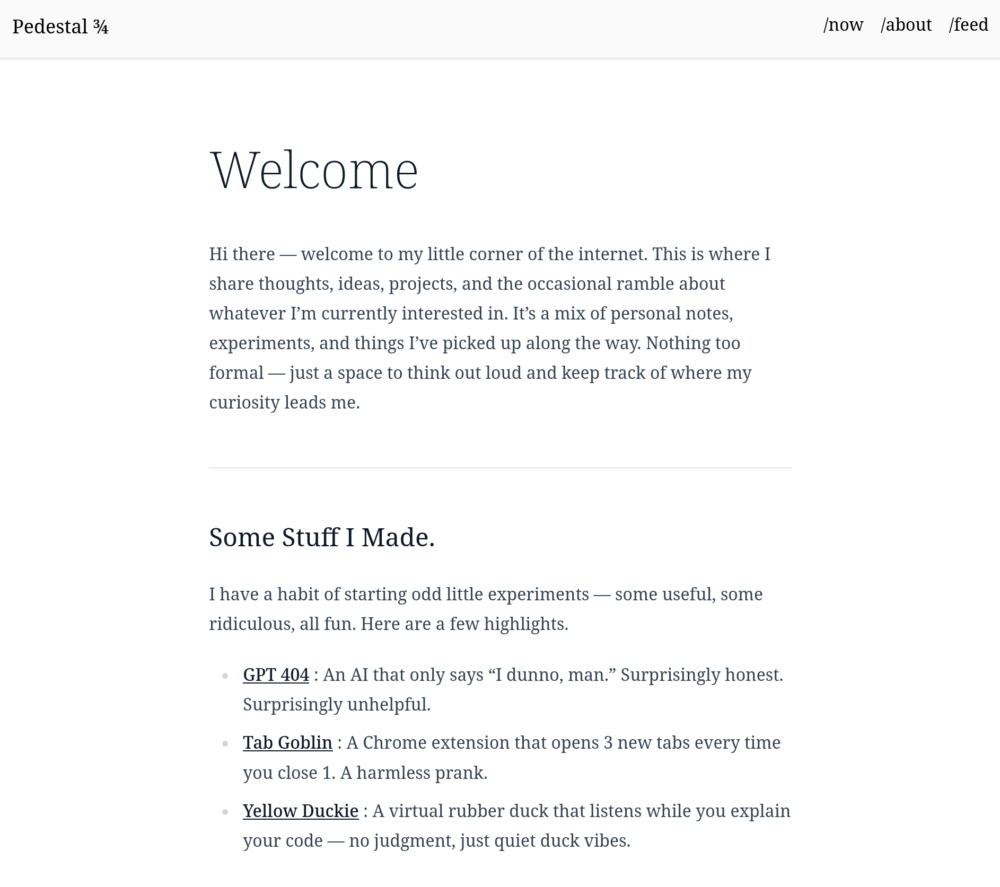

# Pedestal

Minimal static blog template built in [svelte](https://svelte.dev/). A barebones
starting point ~ functional enough to use, minimal enough to reshape into your personal site.

### Features

- 📄 Markdown posts with syntax highlighting.
- 🏷️ Tag-based post filtering.
- 📌 Pin posts to the top.
- 🗂️ Customizable post order.
- 🗞️ RSS feed.

## License

This project is open source and available under the [AGPL License](https://github.com/commitsovercoffee/pedestal/blob/main/LICENSE).
