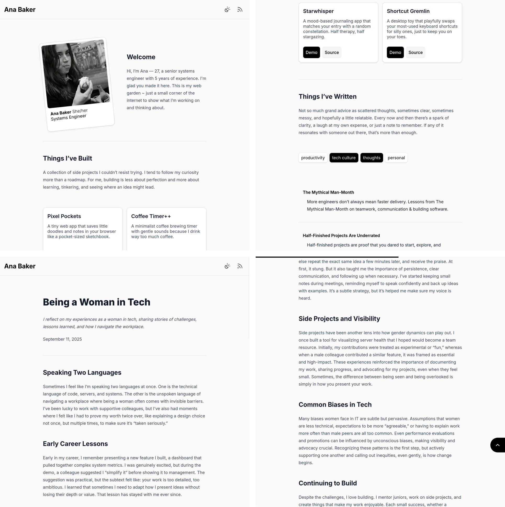

# Pedestal

Just a small blog template I threw together because I keep redesigning my site every few months.
A lean starter template you can bend, twist, and grow into your own indie corner of the web.

## Features

- 📄 Markdown posts.
- 👩‍💻 Dual-tone syntax highlighting.
- 📊 Scroll progress bar.
- ⬆️ Scroll to top.
- 🧩 Custom components.
- 🛠️ Override HTML components.
- 🏷️ Tag post filtering.
- 📌 Pin posts to the top.
- 🗂️ Custom post order.
- 🗞️ RSS feed.

## License

This project is open source and available under the [AGPL License](https://github.com/commitsovercoffee/pedestal/blob/main/LICENSE).
